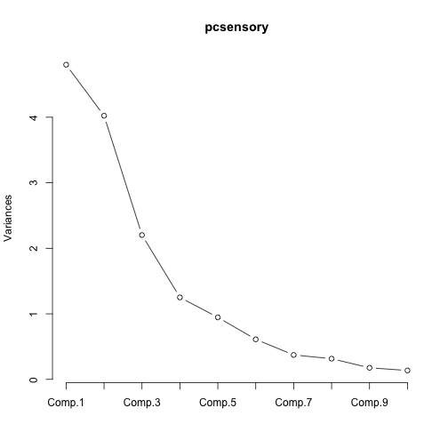
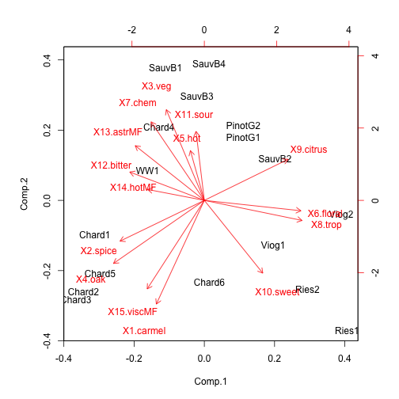
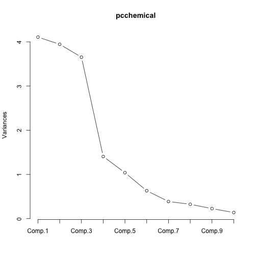
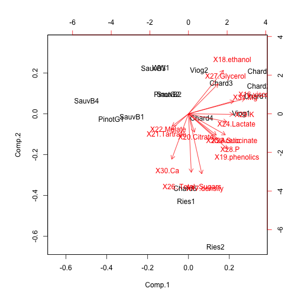
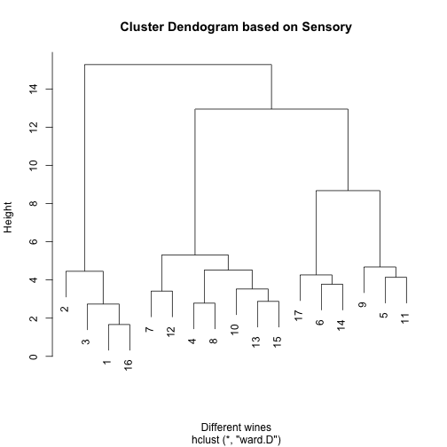
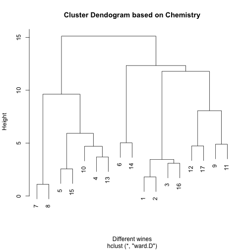
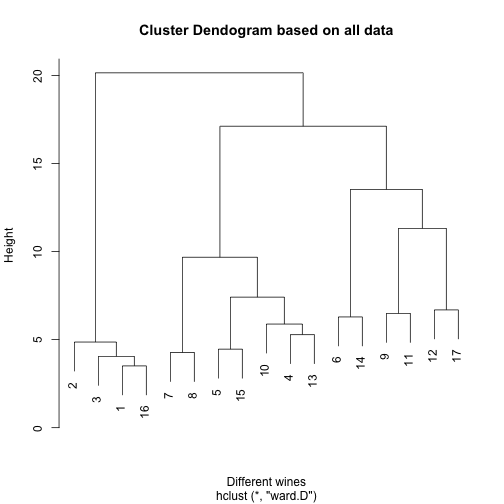

<br>

The purpose of this project is to analyse two different sets that describe a group of wines;

1.-Based on the sensory description of the wines 
2.-Based on the chemical analysis of the wines


The established thesis is that winemaking is an art, and that sensory perception is a better instrument to identify the components that differentiate the taste of wines than the latest chemical instrumental analysis. The data set was used obtained from a study done at UC Davis, both the sensory and chemical analysis were done in triplicate to ensure reliable data.

The Analysis

A correlation matrix was done to determine the use of Factor Analysis and to better understand the main drivers of the data. The PCA were performed for both data sets to determine the principal components of the two first dimensions. 


```r
getwd()
setwd("CourseSessions/Sessions23/project")
list.files()
rm(list = ls())  # Clean up the memory, if we want to rerun from scratch
```


```r
sensorydata <- read.csv("data/sensorystand.csv", sep = ",", dec = ".")
sensory <- data.frame(sensorydata[, -1], row.names = sensorydata[, 1])
round(cor(sensory[, 1:15]), 2)
```

```
##            X1.carmel X2.spice X3.veg X4.oak X5.hot X6.floral X7.chem
## X1.carmel       1.00     0.60  -0.58   0.75  -0.32     -0.17   -0.43
## X2.spice        0.60     1.00  -0.08   0.53  -0.32     -0.42    0.24
## X3.veg         -0.58    -0.08   1.00  -0.12   0.23     -0.49    0.77
## X4.oak          0.75     0.53  -0.12   1.00   0.07     -0.68   -0.06
## X5.hot         -0.32    -0.32   0.23   0.07   1.00     -0.01    0.04
## X6.floral      -0.17    -0.42  -0.49  -0.68  -0.01      1.00   -0.53
## X7.chem        -0.43     0.24   0.77  -0.06   0.04     -0.53    1.00
## X8.trop        -0.11    -0.41  -0.38  -0.61  -0.23      0.79   -0.52
## X9.citrus      -0.60    -0.73   0.03  -0.62   0.36      0.51   -0.34
## X10.sweet       0.25    -0.31  -0.41   0.07  -0.27      0.24   -0.49
## X11.sour       -0.38    -0.13   0.42  -0.28   0.05     -0.08    0.38
## X12.bitter      0.05     0.34   0.36   0.38   0.41     -0.47    0.21
## X13.astrMF     -0.11     0.26   0.28   0.12   0.29     -0.29    0.42
## X14.hotMF       0.17     0.13   0.20   0.36   0.43     -0.16   -0.09
## X15.viscMF      0.82     0.51  -0.35   0.78  -0.11     -0.30   -0.40
##            X8.trop X9.citrus X10.sweet X11.sour X12.bitter X13.astrMF
## X1.carmel    -0.11     -0.60      0.25    -0.38       0.05      -0.11
## X2.spice     -0.41     -0.73     -0.31    -0.13       0.34       0.26
## X3.veg       -0.38      0.03     -0.41     0.42       0.36       0.28
## X4.oak       -0.61     -0.62      0.07    -0.28       0.38       0.12
## X5.hot       -0.23      0.36     -0.27     0.05       0.41       0.29
## X6.floral     0.79      0.51      0.24    -0.08      -0.47      -0.29
## X7.chem      -0.52     -0.34     -0.49     0.38       0.21       0.42
## X8.trop       1.00      0.60      0.33    -0.15      -0.34      -0.53
## X9.citrus     0.60      1.00      0.11    -0.05       0.05      -0.33
## X10.sweet     0.33      0.11      1.00    -0.45      -0.59      -0.67
## X11.sour     -0.15     -0.05     -0.45     1.00      -0.17       0.45
## X12.bitter   -0.34      0.05     -0.59    -0.17       1.00       0.37
## X13.astrMF   -0.53     -0.33     -0.67     0.45       0.37       1.00
## X14.hotMF    -0.19      0.04     -0.40    -0.13       0.78       0.39
## X15.viscMF   -0.19     -0.51      0.23    -0.26       0.17      -0.06
##            X14.hotMF X15.viscMF
## X1.carmel       0.17       0.82
## X2.spice        0.13       0.51
## X3.veg          0.20      -0.35
## X4.oak          0.36       0.78
## X5.hot          0.43      -0.11
## X6.floral      -0.16      -0.30
## X7.chem        -0.09      -0.40
## X8.trop        -0.19      -0.19
## X9.citrus       0.04      -0.51
## X10.sweet      -0.40       0.23
## X11.sour       -0.13      -0.26
## X12.bitter      0.78       0.17
## X13.astrMF      0.39      -0.06
## X14.hotMF       1.00       0.28
## X15.viscMF      0.28       1.00
```

```r
pcsensory <- princomp(sensory[, 1:15], cor = TRUE, scores = TRUE)
summary(pcsensory)
```

```
## Importance of components:
##                           Comp.1    Comp.2    Comp.3    Comp.4     Comp.5
## Standard deviation     2.1912288 2.0057374 1.4840709 1.1182960 0.97269892
## Proportion of Variance 0.3200989 0.2681988 0.1468311 0.0833724 0.06307621
## Cumulative Proportion  0.3200989 0.5882977 0.7351288 0.8185012 0.88157744
##                            Comp.6     Comp.7     Comp.8     Comp.9
## Standard deviation     0.78141916 0.61031043 0.56158948 0.42022447
## Proportion of Variance 0.04070773 0.02483192 0.02102552 0.01177257
## Cumulative Proportion  0.92228517 0.94711709 0.96814261 0.97991518
##                            Comp.10     Comp.11     Comp.12     Comp.13
## Standard deviation     0.367865488 0.312419800 0.211523371 0.137150765
## Proportion of Variance 0.009021668 0.006507075 0.002982809 0.001254022
## Cumulative Proportion  0.988936850 0.995443926 0.998426735 0.999680757
##                             Comp.14      Comp.15
## Standard deviation     0.0612083866 3.228276e-02
## Proportion of Variance 0.0002497644 6.947843e-05
## Cumulative Proportion  0.9999305216 1.000000e+00
```

```r
plot(pcsensory, type = "lines")
```



```r
biplot(pcsensory)
```




The plot shows that the first dimension is positively dominated by Fruity and Tropical Aromas, which are negatively correlated with spice, hot MF (mouth feel) and bitterness

The second dimension is positively correlated to vegetable and sourness while negatively correlated to sweet taste

(All makes sense)

The overall space is well described by the attributes and some groupings of the wines can be seen in the picture. Chardonnays with similar taste (heavy oak influenced) Riesling with similar sweet character, Sauvignon Blanc with herbal and citrus and Viognier with fruity and tropical


```r
chemicaldata <- read.csv("data/chemicalstand.csv", sep = ",", dec = ".")
chemical <- data.frame(chemicaldata[, -1], row.names = sensorydata[, 1])
round(cor(chemical[, 1:16]), 2)
```

```
##                    X16.viscosity X17.density X18.ethanol X19.phenolics
## X16.viscosity               1.00       -0.09        0.82          0.45
## X17.density                -0.09        1.00       -0.61          0.61
## X18.ethanol                 0.82       -0.61        1.00          0.04
## X19.phenolics               0.45        0.61        0.04          1.00
## X20.Citrate                 0.25        0.26        0.13          0.52
## X21.Tartrate               -0.32        0.16       -0.31         -0.24
## X22.Malate                 -0.09        0.08       -0.03          0.34
## X23.Succinate               0.46        0.41        0.09          0.44
## X24.Lactate                 0.37        0.25        0.07          0.15
## X25.Acetic                  0.28        0.33       -0.02          0.22
## X26..Total..Sugars         -0.20        0.93       -0.66          0.41
## X27.Glycerol                0.35       -0.24        0.36          0.06
## X28.P                       0.23        0.53       -0.10          0.52
## X29.K                       0.64        0.20        0.43          0.66
## X30.Ca                     -0.26        0.55       -0.45          0.36
## X31.Mg                      0.72       -0.01        0.55          0.27
##                    X20.Citrate X21.Tartrate X22.Malate X23.Succinate
## X16.viscosity             0.25        -0.32      -0.09          0.46
## X17.density               0.26         0.16       0.08          0.41
## X18.ethanol               0.13        -0.31      -0.03          0.09
## X19.phenolics             0.52        -0.24       0.34          0.44
## X20.Citrate               1.00        -0.13       0.86          0.04
## X21.Tartrate             -0.13         1.00      -0.27         -0.04
## X22.Malate                0.86        -0.27       1.00         -0.14
## X23.Succinate             0.04        -0.04      -0.14          1.00
## X24.Lactate              -0.58         0.11      -0.79          0.64
## X25.Acetic               -0.34         0.29      -0.57          0.37
## X26..Total..Sugars        0.07         0.25      -0.08          0.29
## X27.Glycerol             -0.23        -0.49      -0.22          0.15
## X28.P                    -0.06        -0.05      -0.22          0.14
## X29.K                     0.55        -0.32       0.28          0.16
## X30.Ca                    0.57        -0.04       0.65          0.17
## X31.Mg                    0.25        -0.08      -0.11          0.24
##                    X24.Lactate X25.Acetic X26..Total..Sugars X27.Glycerol
## X16.viscosity             0.37       0.28              -0.20         0.35
## X17.density               0.25       0.33               0.93        -0.24
## X18.ethanol               0.07      -0.02              -0.66         0.36
## X19.phenolics             0.15       0.22               0.41         0.06
## X20.Citrate              -0.58      -0.34               0.07        -0.23
## X21.Tartrate              0.11       0.29               0.25        -0.49
## X22.Malate               -0.79      -0.57              -0.08        -0.22
## X23.Succinate             0.64       0.37               0.29         0.15
## X24.Lactate               1.00       0.72               0.31         0.24
## X25.Acetic                0.72       1.00               0.43        -0.24
## X26..Total..Sugars        0.31       0.43               1.00        -0.36
## X27.Glycerol              0.24      -0.24              -0.36         1.00
## X28.P                     0.36       0.40               0.45         0.19
## X29.K                    -0.01      -0.15              -0.05         0.43
## X30.Ca                   -0.36      -0.15               0.48        -0.50
## X31.Mg                    0.22       0.26              -0.24         0.20
##                    X28.P X29.K X30.Ca X31.Mg
## X16.viscosity       0.23  0.64  -0.26   0.72
## X17.density         0.53  0.20   0.55  -0.01
## X18.ethanol        -0.10  0.43  -0.45   0.55
## X19.phenolics       0.52  0.66   0.36   0.27
## X20.Citrate        -0.06  0.55   0.57   0.25
## X21.Tartrate       -0.05 -0.32  -0.04  -0.08
## X22.Malate         -0.22  0.28   0.65  -0.11
## X23.Succinate       0.14  0.16   0.17   0.24
## X24.Lactate         0.36 -0.01  -0.36   0.22
## X25.Acetic          0.40 -0.15  -0.15   0.26
## X26..Total..Sugars  0.45 -0.05   0.48  -0.24
## X27.Glycerol        0.19  0.43  -0.50   0.20
## X28.P               1.00  0.42   0.09   0.19
## X29.K               0.42  1.00  -0.06   0.58
## X30.Ca              0.09 -0.06   1.00  -0.26
## X31.Mg              0.19  0.58  -0.26   1.00
```

```r
pcchemical <- princomp(chemical[, 1:16], cor = TRUE, scores = TRUE)
summary(pcchemical)
```

```
## Importance of components:
##                           Comp.1    Comp.2    Comp.3     Comp.4     Comp.5
## Standard deviation     2.0265769 1.9861333 1.9112892 1.18546681 1.01976223
## Proportion of Variance 0.2566884 0.2465453 0.2283141 0.08783322 0.06499469
## Cumulative Proportion  0.2566884 0.5032337 0.7315479 0.81938109 0.88437578
##                            Comp.6    Comp.7     Comp.8     Comp.9
## Standard deviation     0.79424454 0.6224082 0.56961685 0.47545743
## Proportion of Variance 0.03942652 0.0242120 0.02027896 0.01412874
## Cumulative Proportion  0.92380230 0.9480143 0.96829326 0.98242199
##                            Comp.10     Comp.11     Comp.12     Comp.13
## Standard deviation     0.371000132 0.249631370 0.218319857 0.131386418
## Proportion of Variance 0.008602569 0.003894739 0.002978972 0.001078899
## Cumulative Proportion  0.991024560 0.994919298 0.997898271 0.998977170
##                             Comp.14      Comp.15      Comp.16
## Standard deviation     0.0970947457 0.0832330649 3.184503e-03
## Proportion of Variance 0.0005892119 0.0004329839 6.338162e-07
## Cumulative Proportion  0.9995663822 0.9999993662 1.000000e+00
```

```r
plot(pcchemical, type = "lines")
```



```r
biplot(pcchemical)
```


<br>


The chemical PCA is a little more difficult to interpret. The vectors are not evenly distributed and a particular group of wines are not described by the chemistry (SauvB). The Chardonnay seems to be correlated with Glycerol (vanilla taste) makes sense for a Napa Chardonnay. Rieslings on the other hand are again described as sweet. 

Sensory analysis describes more of the variance in two dimensions, each attribute seems to be relevant and better interpretation can be derived from the sensory PCA 


```r
wine_std <- read.table("data/standardized.csv", header = TRUE, sep = ",", na.strings = "NA", 
    dec = ".", strip.white = TRUE)
HClust.1 <- hclust(dist(model.matrix(~-1 + X1.carmel + X2.spice + X3.veg + X4.oak + 
    X5.hot + X6.floral + X7.chem + X8.trop + X9.citrus + X10.sweet + X11.sour + 
    X12.bitter + X13.astrMF + X14.hotMF + X15.viscMF, wine_std)), method = "ward")
```

```
## The "ward" method has been renamed to "ward.D"; note new "ward.D2"
```

```r
plot(HClust.1, main = "Cluster Dendogram based on Sensory", xlab = "Different wines")
```




```r
HClust.2 <- hclust(dist(model.matrix(~-1 + X16.viscosity + X17.density + X18.ethanol + 
    X19.phenolics + X20.Citrate + X21.Tartrate + X22.Malate + X23.Succinate + 
    X24.Lactate + X25.Acetic + X26.Total.Sugars + X27.Glycerol + X28.P + X29.K + 
    X30.Ca + X31.Mg + X32.Na + X33.Cl + X34.pH + X35.TA, wine_std)), method = "ward")
```

```
## The "ward" method has been renamed to "ward.D"; note new "ward.D2"
```

```r
plot(HClust.2, main = "Cluster Dendogram based on Chemistry", xlab = "Different wines")
```



## Including Plots

You can also embed plots, for example:


```r
HClust.3 <- hclust(dist(model.matrix(~-1 + X1.carmel + X2.spice + X3.veg + X4.oak + 
    X5.hot + X6.floral + X7.chem + X8.trop + X9.citrus + X10.sweet + X11.sour + 
    X12.bitter + X13.astrMF + X14.hotMF + X15.viscMF + X16.viscosity + X17.density + 
    X18.ethanol + X19.phenolics + X20.Citrate + X21.Tartrate + X22.Malate + 
    X23.Succinate + X24.Lactate + X25.Acetic + X26.Total.Sugars + X27.Glycerol + 
    X28.P + X29.K + X30.Ca + X31.Mg + X32.Na + X33.Cl + X34.pH + X35.TA, wine_std)), 
    method = "ward")
```

```
## The "ward" method has been renamed to "ward.D"; note new "ward.D2"
```

```r
plot(HClust.3, main = "Cluster Dendogram based on all data", xlab = "Different wines")
```



Note that the `echo = FALSE` parameter was added to the code chunk to prevent printing of the R code that generated the plot.
